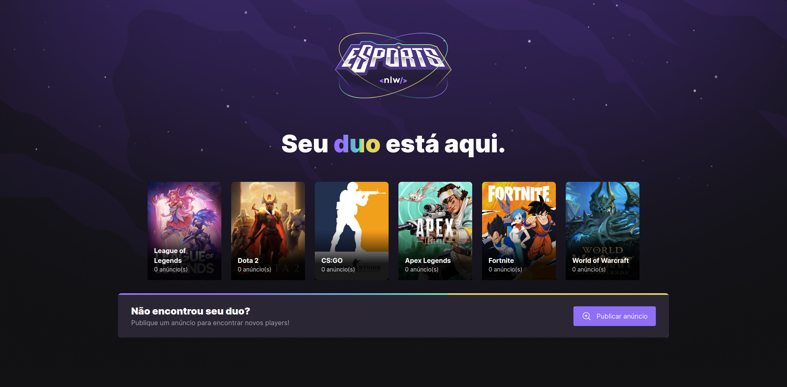
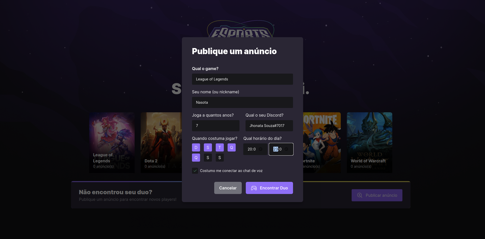
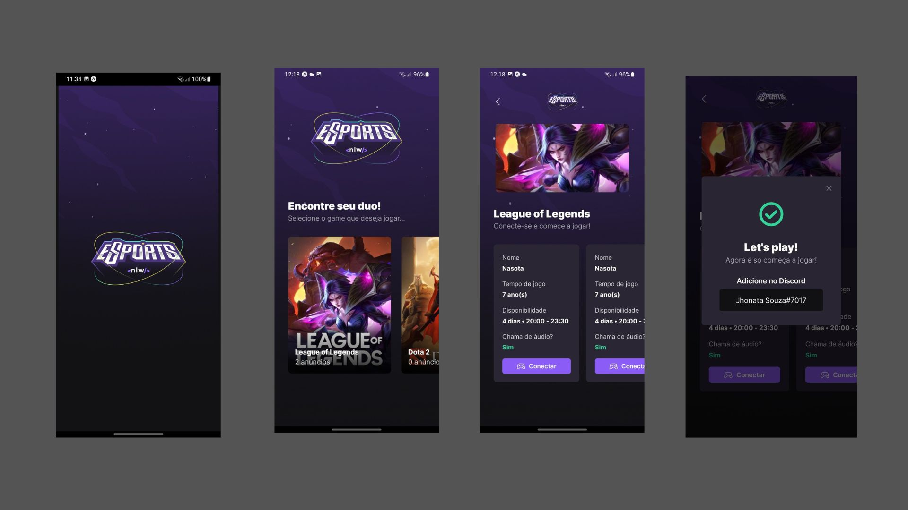

<h1 align="center">
    
</h1>

<div align="center">
    
    
    <a href="https://github.com/einasota/nlw9-esports/commits/main"> 
    
    </a>
    <a href="https://github.com/einasota/nlw9-esports/blob/main/LICENSE.md">
    
    </a>
</div>
<div align="center" > 

[About](#about) | [Technologies](#technologies) | 

</div>


## About
---

NLW eSports is an app developed during the Next Level Week by the Ignite trail that is organized and presented by @Rocketseat where the use of the JavaScript Stack (TypeScript, NodeJS, React, React Native, HTML and CSS) is shown in a simple and intelligent way of how an App is developed in practice.

The Application has the functionality to connect players from a variety of games through a small form, through which they provide information to find the best partner to play.

Through the web version it is possible to register to find a game. As shown in the following images:

</br>





By the mobile version it is possible to find players according to date and time to connect via Discord:




## Technologies
* [TypeSript](https://www.typescriptlang.org/)
* [NodeJS](https://nodejs.org/en/)
* [ReactJS](https://reactjs.org/)
* [React Native](https://reactnative.dev/)
* [Prisma](https://www.prisma.io/)
* [Expo](https://expo.dev/)

## How To Use
### Requirements

- NodeJS >= 14.17
- yarn or npm

> Use the example Environment Variables files located in the server and mobile folders and rename them to .env

#### Run in all folders (server, web, mobile)
```shell
yarn install
or
npm install
```

#### Run Migration in server folder
```shell
npx prisma migrate dev
```
#### Create games in database
Create using prisma studio in game table
``` shell
npx prisma studio
```
#### Start services (in server, web folders)
```shell
yarn dev
npm run dev
```
#### Start mobile service

```shell
npx expo start
```
### Using the Expo Go
<div>
<h4> Download </h4>
<a href="https://play.google.com/store/apps/details?id=host.exp.exponent&hl=pt_BR&gl=US&pli=1">

</a>
<a href="https://apps.apple.com/br/app/expo-go/id982107779"> 

</a>

</br>

</div>

Use the app to connect and test from your own smartphone. Use the QRCode option in the app and scan the QRCode in the terminal.

### Using the Browser

Use the ip: http://127.0.0.1:3333/

## License
This project is licensed under the MIT license. See the [LICENSE](./LICENSE.md) file for more details.